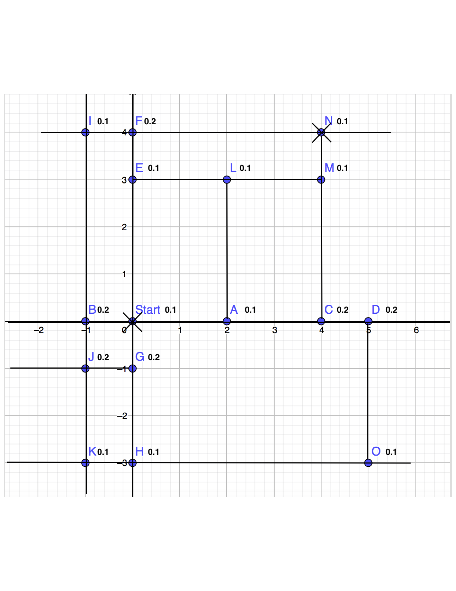
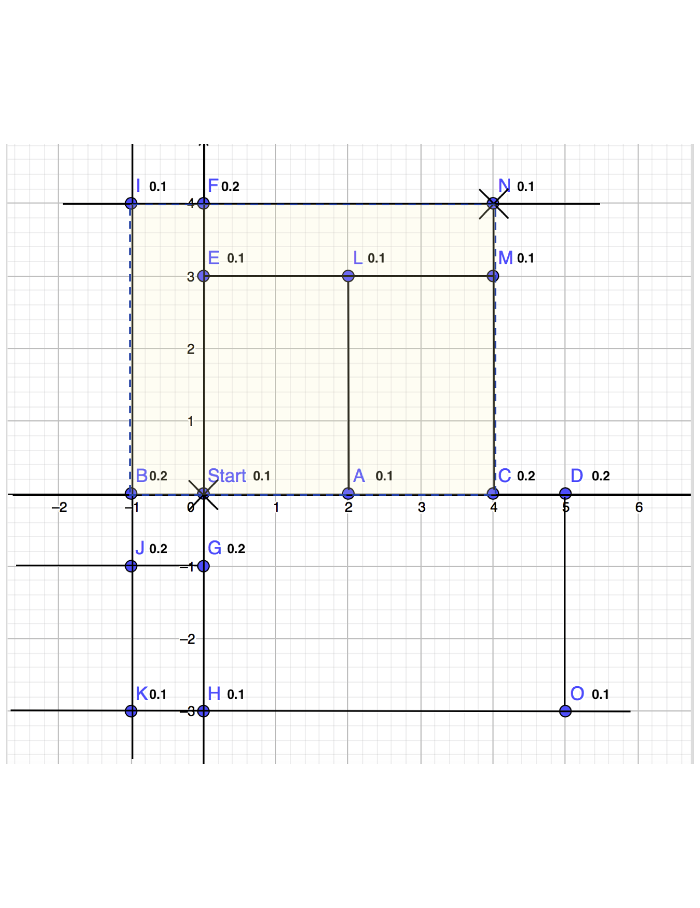

# Route-Planner-for-Runner
This is a route planner for specific users: runner. The common route planners like google map, it is designed to find a shortest path to the goal places. For people who would like run in the city, there are more specific requirement like: security, sunshine, length of the route, places to pass by and so on. This route planner could give a better route for runner.

# Simple model
The basic idea is to design a algorithm based on A* to make route plan which could satisfy requirements for runner.

So far, it is a simple implementation of the algorithm. To simplify the map, I build a simple model to simulate the real street map.(Figure 1). I used nodes to imply every corner, numbers to imply the crime rate of this place, and a pair of number to imply the coordinate of this place.

Different from the A* algorithm, I used a new function to calculate f. Here f = DistanceDifference * CrimeRate. Here DistanceDifference = abs( g + h - l ). Here g and is the same with the g in A* which is distance between the current node and the start node, and h is the heuristic distance from the current node to the end node. Here l is user’s setting length of the route. So DistanceDifference is the difference between the user’s setting length with the real length of the route. The CrimeRate = CycleRate. CycleRate is the average crime rate of the surrounding between the current node with the goal (Figure 2). The best node we can pick to move forward with is the node with smallest value of f. From the start node, find the adjacent nodes and calculate their value of f and picked the node with the smallest value of f. Keep spreading until we find the goal place and at the same time, the route length is close to the length as the user set before. Finally, return the path. One node could be picked more than one time.

# Result
For the map like the figure1, start node is (0, 0), goal node is (4, 4), when the setting length of the route is 40, an optimal route is:
[(0, 0), (0, 3), (2, 3), (4, 3), (2, 3), (4, 3), (2, 3), (2, 0), (2, 3), (2, 0), (2, 3), (2, 0), (0, 0), (-1, 0), (-1, 4), (0, 4), (4, 4)]

# Further Steps
From the result of a test example, we can see it is a path with some nodes repeated for more than one time. There are two reasons. First, in order to simplify the problem, I just used a limited map. Second, for a runner, we assume that passing by a same places would be acceptable. Different from the common route planner, this route planner adds setting length of the route and surrounding security rate to make plan. The goal of the route planner is to find a most proper and safe path based on user’s requirement, rather than to find a shortest path.

This is just a simple demo, next step, I would like to add more personal sitting like: setting places prefer to passing by. And I would use real data via google map API and city crime rate related API, and display route in a iOS App.

Another aspect where I can improve the application in the future is the f function. When the requirement increase, the details of the function would change. Different requirement may have different weight. So one method to get a reasonable weight so that we can make a best route for user is to use machine learning technology to learn user’s preference.

May is my favorite month. Summer is coming, don't waste such a beautiful time all day in the room. Go outdoor, run along the green street and share happiness to people around you!
